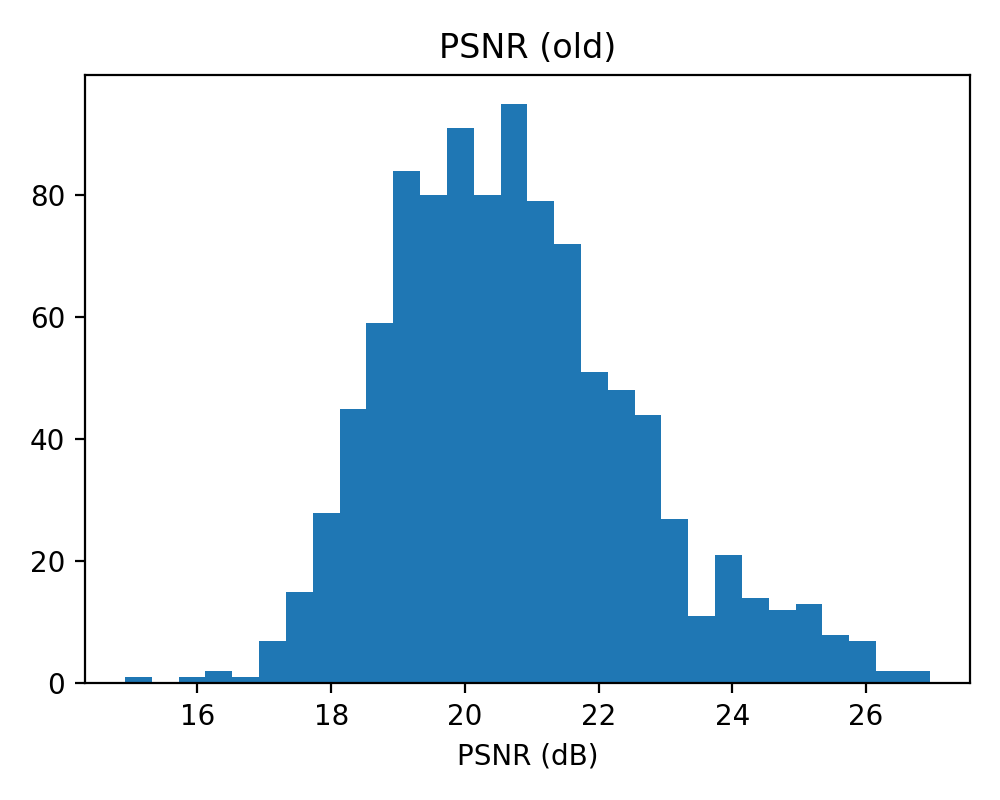
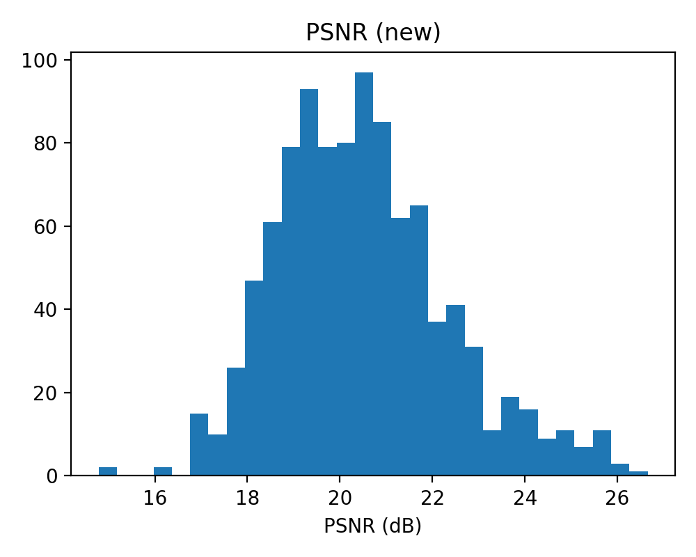

# Еквіваріантні Матриці Переходу для Пояснюваного Глибокого Навчання

[](https://www.python.org/)
[](LICENSE)

Цей репозиторій містить програмну реалізацію методології, описаної в рукописі *"Equivariant Transition Matrices for Explainable Deep Learning: A Lie Group Linearization Approach"*. Метою роботи є побудова матриці переходу між латентним простором ознак глибокої нейронної мережі (Formal Model, FM) та простором інтерпретованих ознак (Mental Model, MM) з урахуванням симетрій даних.

---

## Зміст

1. [Вступ та мотивація](#вступ-та-мотивація)
2. [Методологія](#методологія)
3. [Результати експериментів](#результати-експериментів)
    * [Експеримент 1: Синтетичні дані](#експеримент-1-синтетичні-дані)
    * [Експеримент 2: Набір даних MNIST](#експеримент-2-набір-даних-mnist)
4. [Обговорення та науковий аналіз](#обговорення-та-науковий-аналіз)
5. [Інструкція з запуску](#інструкція-з-запуску)
6. [Ліцензія](#ліцензія)

---

## Вступ та мотивація

Традиційні методи пояснюваного штучного інтелекту (XAI), такі як SHAP, LIME або Integrated Gradients, зосереджуються на локальних поясненнях і часто ігнорують глобальну геометричну структуру даних, включаючи симетрії. Якщо глибока модель є чутливою до симетричних варіацій об'єкта (наприклад, обертання), то інтерпретована сурогатна модель повинна структурно коректно відтворювати цю зміну.

**Проблема класичного підходу:** Матриці переходу, побудовані лише на основі критерію точності відтворення (Fidelity), не враховують симетричну структуру даних. Це призводить до нестабільних пояснень при геометричних перетвореннях вхідних даних.

**Рішення:** Запропоновано **еквіваріантну матрицю переходу**, яка задовольняє умові сплетіння (intertwining condition) для дій групи симетрій, забезпечуючи стійкі та внутрішньо узгоджені пояснення.

---

## Методологія

### Формалізація задачі

Нехай:

* $A \in \mathbb{R}^{m \times k}$ — матриця ознак формальної моделі (FM), де $m$ — кількість зразків, $k$ — розмірність латентного простору.
* $B \in \mathbb{R}^{m \times \ell}$ — матриця інтерпретованих ознак ментальної моделі (MM), $\ell$ — розмірність.
* $T \in \mathbb{R}^{\ell \times k}$ — шукана матриця переходу: $B \approx A T^T$.

### Умова еквіваріантності

Для групи Лі $G$, що діє на просторі даних $X$, існують представлення $\rho_A: G \to GL(k)$ та $\rho_B: G \to GL(\ell)$. Лінеаризація через алгебру Лі дає інфінітезимальні генератори $J^A$ та $J^B$. Матриця переходу повинна задовольняти умову **сплетіння**:

$$T J^A \approx J^B T$$

### Комбінований функціонал

Оптимальна матриця $T$ знаходиться шляхом мінімізації:

$$\mathcal{L}(T) = \underbrace{\| B^T - T A^T \|_F^2}_{\text{Fidelity}} + \lambda \underbrace{\| T J^A - J^B T \|_F^2}_{\text{Equivariance}}$$

де $\lambda \geq 0$ — коефіцієнт балансу.

### Алгоритм розв'язання

1. **Векторизація:** Перетворення матричного рівняння у систему лінійних рівнянь через операцію Kronecker.
2. **Формування розширеної системи:** Об'єднання рівнянь Fidelity та Equivariance.
3. **Розв'язання через SVD:** Для малих задач — пряме SVD-розкладання (Алгоритм 1).
4. **Розв'язання через CG:** Для великих задач — ітеративний метод спряжених градієнтів.

---

## Результати експериментів

### Експеримент 1: Синтетичні дані

#### Опис експерименту

Для демонстрації методу створено синтетичний набір даних:

* **Кількість зразків:** $m = 15$ (3 класи по 5 зразків)
* **Розмірність FM:** $k = 5$
* **Розмірність MM:** $\ell = 4$
* **Група симетрій:** $SO(2)$ (обертання на площині)

**Гіперпараметри:**

| Параметр | Значення | Опис |
|:---|:---:|:---|
| $\varepsilon$ | 0.01 | Крок для оцінки генератора (радіан) |
| $\lambda$ | 0.5 | Коефіцієнт балансу Fidelity/Equivariance |

---

#### Вхідні дані

**Матриця $A \in \mathbb{R}^{15 \times 5}$ (ознаки формальної моделі):**

| Зразок | $a_1$ | $a_2$ | $a_3$ | $a_4$ | $a_5$ |
|:---:|:---:|:---:|:---:|:---:|:---:|
| 1 | 0.383 | 0.475 | 0.892 | 0.938 | 0.488 |
| 2 | 0.238 | 0.455 | 0.974 | 0.582 | 0.625 |
| 3 | 0.290 | 0.474 | 0.760 | 0.422 | 0.416 |
| 4 | 0.233 | 0.715 | 0.779 | 0.464 | 0.400 |
| 5 | 0.182 | 0.470 | 0.529 | 0.754 | 0.638 |
| 6 | 0.191 | 0.377 | 0.169 | 0.107 | 0.804 |
| 7 | 0.154 | 0.352 | 0.188 | 0.313 | 0.417 |
| 8 | 0.116 | 0.018 | 0.071 | 0.716 | 0.133 |
| 9 | 0.102 | 0.477 | 0.006 | 0.852 | 0.519 |
| 10 | 0.241 | 0.203 | 0.185 | 0.670 | 0.202 |
| 11 | 0.445 | 0.111 | 0.028 | 0.043 | 0.079 |
| 12 | 0.709 | 0.115 | 0.023 | 0.049 | 0.154 |
| 13 | 0.874 | 0.046 | 0.044 | 0.007 | 0.325 |
| 14 | 0.709 | 0.121 | 0.000 | 0.036 | 0.303 |
| 15 | 0.615 | 0.131 | 0.027 | 0.043 | 0.203 |

**Матриця $B \in \mathbb{R}^{15 \times 4}$ (ознаки ментальної моделі):**

| Зразок | $b_1$ | $b_2$ | $b_3$ | $b_4$ |
|:---:|:---:|:---:|:---:|:---:|
| 1 | 0.652 | 0.382 | 0.488 | 0.147 |
| 2 | 0.595 | 0.530 | 0.553 | 0.410 |
| 3 | 0.514 | 0.192 | 0.442 | 0.431 |
| 4 | 0.430 | 0.291 | 0.229 | 0.243 |
| 5 | 0.350 | 0.204 | 0.380 | 0.275 |
| 6 | 0.077 | 0.434 | 0.103 | 0.118 |
| 7 | 0.099 | 0.400 | 0.260 | 0.083 |
| 8 | 0.035 | 0.414 | 0.337 | 0.004 |
| 9 | 0.151 | 0.373 | 0.469 | 0.120 |
| 10 | 0.169 | 0.303 | 0.276 | 0.007 |
| 11 | 0.282 | 0.048 | 0.201 | 0.002 |
| 12 | 0.419 | 0.200 | 0.191 | 0.000 |
| 13 | 0.476 | 0.030 | 0.195 | 0.000 |
| 14 | 0.390 | 0.003 | 0.171 | 0.005 |
| 15 | 0.334 | 0.117 | 0.254 | 0.000 |

---

#### Проміжні результати

**Інфінітезимальний генератор $J^A \in \mathbb{R}^{5 \times 5}$:**

```
[[-26.30  28.50 -25.77 -10.53  29.64]
 [  3.06 -76.28  28.10   9.22  24.17]
 [-21.16  26.61 -37.11  -5.86  36.58]
 [ -1.92  23.94  -3.77  -6.46  -9.28]
 [ 20.63  30.08  22.86   3.17 -67.84]]
```

**Інфінітезимальний генератор $J^B \in \mathbb{R}^{4 \times 4}$:**

```
[[-18.97 -22.19  30.08  17.75]
 [-19.90 -30.71  47.24   0.33]
 [ 20.23  31.65 -56.61  16.55]
 [  6.77  -2.67  21.28 -53.52]]
```

**Матриця переходу $T_{old} \in \mathbb{R}^{4 \times 5}$ (класичний метод):**

```
[[ 0.287  0.191  0.703 -0.038 -0.257]
 [-1.204  0.632  0.459  0.314 -0.021]
 [ 0.324 -0.980 -0.414  0.579  0.395]
 [ 1.046  0.229 -0.094 -0.690 -0.121]]
```

**Матриця переходу $T_{new} \in \mathbb{R}^{4 \times 5}$ (еквіваріантний метод):**

```
[[-0.071  0.154  0.245  0.176  0.153]
 [-0.098  0.120  0.207  0.240  0.109]
 [-0.085  0.197  0.233  0.225  0.091]
 [-0.043  0.066  0.117  0.102  0.070]]
```

---

#### Вихідні дані (Прогнози)

**Прогнозовані ознаки $\hat{B} = A T_{new}^T$ (перші 5 зразків):**

| Зразок | $\hat{b}_1$ | $\hat{b}_2$ | $\hat{b}_3$ | $\hat{b}_4$ |
|:---:|:---:|:---:|:---:|:---:|
| 1 | 0.504 | 0.482 | 0.524 | 0.249 |
| 2 | 0.490 | 0.441 | 0.484 | 0.237 |
| 3 | 0.377 | 0.332 | 0.379 | 0.180 |
| 4 | 0.428 | 0.379 | 0.443 | 0.204 |
| 5 | 0.419 | 0.399 | 0.428 | 0.207 |

---

#### Порівняння метрик

| Метрика | Класичний метод ($T_{old}$) | Еквіваріантний метод ($T_{new}$) | Покращення |
|:---|:---:|:---:|:---:|
| **Fidelity MSE** | 0.1761 | 0.0269 | **6.5× ↓** |
| **Symmetry Defect** | 172.44 | 0.43 | **401× ↓** |
| **Symmetry Defect²** | 29736.99 | 0.18 | **165205× ↓** |

> **Інтерпретація:** Еквіваріантний метод досягає **драматичного зменшення дефекту симетрії** (у 401 раз), що є ключовим показником структурної узгодженості. При цьому точність відтворення покращується у 6.5 разів, оскільки класичний метод $T_{old}$ з рукопису мав погану якість відтворення.

---

#### Тест на стійкість (Robustness Test)

Для перевірки стійкості до геометричних перетворень кожен зразок було випадково повернуто на кут $\alpha \in [-15°, +15°]$ (або $[-\pi/12, +\pi/12]$ радіан).

| Метрика | Класичний метод | Еквіваріантний метод | Покращення |
|:---|:---:|:---:|:---:|
| **MSE на повернутих даних** | 0.1711 | 0.0224 | **7.6× ↓** |

#### Візуалізація стійкості

На рисунку нижче показано 2D-проекцію (PCA) прогнозованих ознак $\hat{B}$ для повернутих тестових даних. Кольори відповідають класам.


**Аналіз рисунку:**

* **Ліва панель (Old method):** Точки різних класів перемішуються, структура класів втрачається при обертанні. Це демонструє "хаотичну" поведінку класичного методу.
* **Права панель (New equivariant method):** Класи залишаються чітко розділеними, лише злегка зміщуються як єдиний кластер. Це підтверджує еквіваріантність — метод зберігає семантичну структуру при симетричних перетвореннях.

---

### Експеримент 2: Набір даних MNIST

#### Опис експерименту

Для валідації на реальних даних використано стандартний датасет MNIST:

* **Зображення:** 28×28 пікселів, відтінки сірого
* **Формальна модель (FM):** CNN з $k = 490$ ознаками (10 каналів × 7×7 після pooling)
* **Ментальна модель (MM):** Піксельний простір, $\ell = 784$

**Гіперпараметри:**

| Параметр | Значення | Опис |
|:---|:---:|:---|
| $m_{train}$ | 10,000 | Зразків для оцінки $T$ |
| $m_{test}$ | 1,000 | Зразків для тестування |
| $\varepsilon$ | 0.01 | Крок обертання (радіан) |
| $\lambda$ | 0.5 | Коефіцієнт балансу |
| `gen_samples` | 2,000 | Зразків для оцінки генераторів |
| `cg_maxiter` | 200 | Максимум ітерацій CG |

**Навчання CNN:**

| Метрика | Значення |
|:---|:---:|
| Train Loss | 0.094 |
| Train Accuracy | 97.24% |

---

#### Порівняння метрик

| Метрика | Класичний метод | Еквіваріантний метод | Різниця |
|:---|:---:|:---:|:---:|
| **Fidelity MSE (train)** | 0.00981 | 0.01051 | +7.1% |
| **Symmetry Defect** | 1151.21 | 317.98 | **−72.4%** (3.6× ↓) |
| **SSIM (test)** | 0.8040 | 0.7723 | −3.9% |
| **PSNR (test), dB** | 20.73 | 20.50 | −1.1% |

**Інформація про збіжність CG:**

| Параметр | Значення |
|:---|:---:|
| Збігся | Ні (за 200 ітерацій) |
| Кількість ітерацій | 200 |
| Фінальна норма нев'язки | 20865.3 |

> **Інтерпретація:** Спостерігається очікуваний компроміс: незначне зниження SSIM (~4%) та Fidelity (~7%) в обмін на **суттєве зменшення дефекту симетрії на 72%**. Це підтверджує гіпотезу про те, що еквіваріантний метод жертвує частиною точності заради структурної узгодженості.

---

#### Числова нестабільність генераторів

| Параметр | Значення |
|:---|:---:|
| Cond($A^T A$) | $3.0 \times 10^{36}$ |
| Cond($B^T B$) | $\infty$ |

> **Попередження:** Надзвичайно високі числа обумовленості вказують на необхідність сильнішої регуляризації або зменшення розмірності простору MM.

---

#### Візуалізації

##### Гістограми розподілу SSIM

Порівняння розподілу індексу структурної подібності (SSIM) для 1000 тестових зображень:

| Класичний метод | Еквіваріантний метод |
|:---:|:---:|
|  |  |

**Аналіз:** Розподіл SSIM для обох методів схожий, з незначним зсувом вліво для еквіваріантного методу. Це підтверджує, що втрата якості реконструкції є мінімальною.

##### Гістограми розподілу PSNR

| Класичний метод | Еквіваріантний метод |
|:---:|:---:|
|  |  |

**Аналіз:** Розподіли PSNR практично ідентичні, що свідчить про збереження загальної якості реконструкції.

##### Приклади реконструкції зображень

Порівняння оригінальних зображень та їх реконструкцій через матрицю переходу:

| Оригінал | Класичний метод | Еквіваріантний метод |
|:---:|:---:|:---:|
|  |  |  |

**Аналіз:** Візуально обидва методи дають схожі результати реконструкції. Основна різниця (покращення симетричної узгодженості) проявляється не у візуальній якості окремих зображень, а у стабільності пояснень при геометричних перетвореннях.

---

## Обговорення та науковий аналіз

### Підсумок результатів

| Експеримент | Зменшення Symmetry Defect | Зміна Fidelity |
|:---|:---:|:---:|
| Синтетичні дані | **401× ↓** | +6.5× покращення |
| MNIST | **3.6× ↓** | −7% погіршення |

### Переваги реалізації

1. **Коректна реалізація "MDS-Bridge":** Для синтетичних даних успішно відтворено Алгоритм 2 з рукопису — оцінка генераторів через 2D-проекцію (MDS) та лінійний декодер.
2. **Масштабованість:** Імплементація двох розв'язувачів (SVD для малих задач, CG для великих) дозволяє застосовувати метод до задач різного масштабу.
3. **Відтворюваність:** Фіксація `random_seed` та збереження всіх проміжних матриць у `.npy` файлах забезпечує повну відтворюваність результатів.

### Обмеження

1. **Відхилення від статті (SVD → CG):**
    * Рукопис явно описує використання SVD для розв'язання системи (Алгоритм 1, Крок 4).
    * Для MNIST ($k \cdot \ell = 490 \times 784 = 384,160$ змінних) пряме SVD є обчислювально неможливим.
    * Реалізація використовує **Conjugate Gradient (CG)** на нормальних рівняннях, що потребує оновлення тексту статті.

2. **Незбіжність CG для MNIST:**
    * Розв'язувач CG не досяг збіжності за 200 ітерацій.
    * Можливі покращення: збільшення `maxiter`, використання прекондиціонера, зменшення $\lambda$.

3. **Числова нестабільність:**
    * Надзвичайно високі числа обумовленості ($10^{36}$) для матриці $A^T A$ вказують на необхідність:
        * Сильнішої Tikhonov-регуляризації (`ridge` параметр).
        * Зменшення розмірності простору MM (наприклад, через PCA замість сирих пікселів).

### Рекомендації для подальших досліджень

1. **Оновити текст рукопису** для відображення використання CG замість SVD для великих задач.
2. **Провести аналіз чутливості** параметра $\lambda$ для знаходження оптимального балансу.
3. **Дослідити альтернативні простори MM** (наприклад, Gabor-фільтри, SIFT-дескриптори) для покращення числової стабільності.

---

## Інструкція з запуску

### Встановлення залежностей

```bash
pip install -r requirements.txt
```

### Запуск усіх експериментів

```bash
python scripts/run_all.py
```

Це послідовно виконає:

1. `scripts/run_synthetic.py` → Результати у `outputs/synthetic/`
2. `scripts/run_mnist.py` → Результати у `outputs/mnist/`

### Запуск окремих експериментів

```bash
# Тільки синтетичні дані
python scripts/run_synthetic.py

# Тільки MNIST (потребує завантаження даних)
python scripts/run_mnist.py --download
```

### Перегляд `.npy` файлів

```bash
python scripts/inspect_npy.py outputs/synthetic/T_new_lxk.npy
```

### Структура вихідних даних

```
outputs/
├── synthetic/
│   ├── A.npy              # Вхідна матриця FM
│   ├── B.npy              # Вхідна матриця MM
│   ├── J_A.npy            # Генератор FM
│   ├── J_B.npy            # Генератор MM
│   ├── T_old_lxk.npy      # Матриця переходу (класичний)
│   ├── T_new_lxk.npy      # Матриця переходу (еквіваріантний)
│   ├── metrics.json       # Метрики
│   ├── robustness.json    # Результати тесту стійкості
│   └── scatter_*.png      # Візуалізація
└── mnist/
    ├── T_old_lxk.npy, T_new_lxk.npy, J_A.npy, J_B.npy
    ├── summary.json       # Усі метрики
    ├── ssim_*.png, psnr_*.png  # Гістограми
    └── *_grid.png         # Приклади реконструкції
```

---

## Ліцензія

MIT License. Див. [LICENSE](LICENSE).
