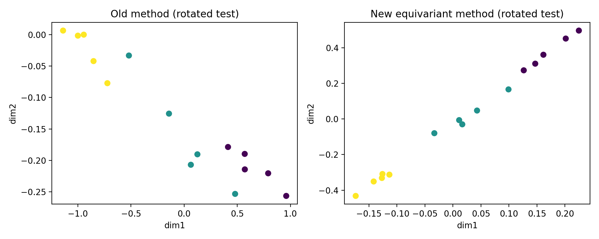
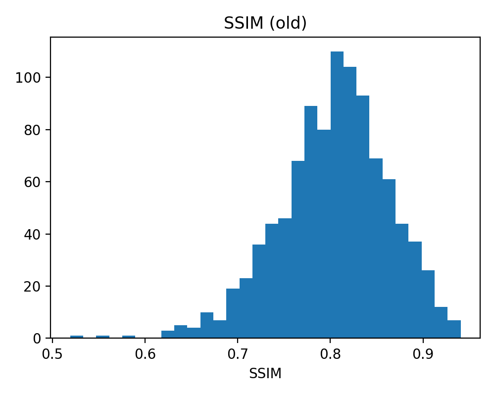
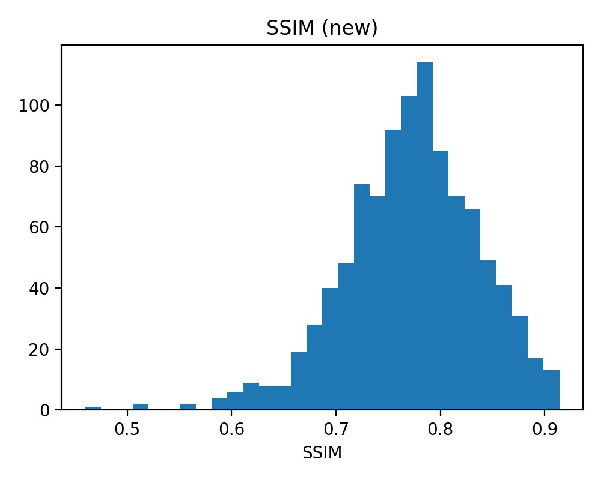
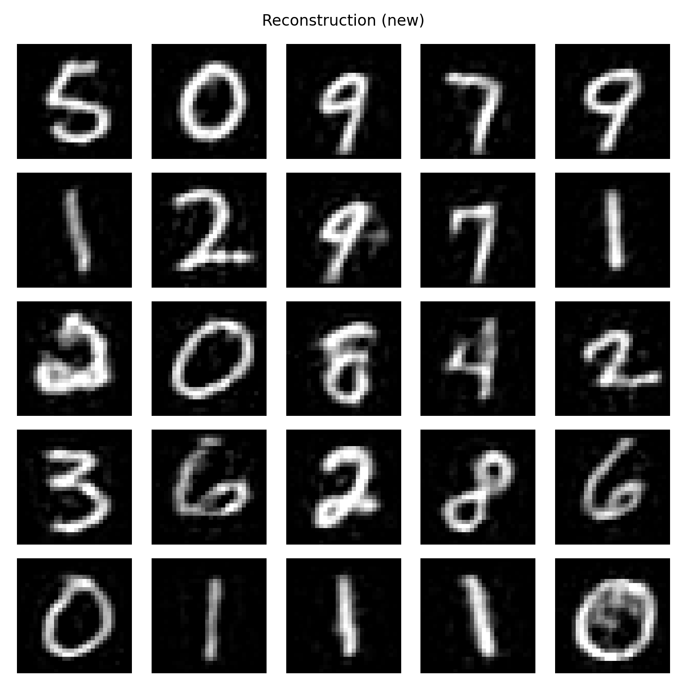

# Еквіваріантні Матриці Переходу для Пояснюваного Глибокого Навчання

[](https://www.python.org/)
[](LICENSE)

Цей репозиторій містить програмну реалізацію методології, описаної в рукописі *"Equivariant Transition Matrices for Explainable Deep Learning: A Lie Group Linearization Approach"*. Метою роботи є побудова матриці переходу між латентним простором ознак глибокої нейронної мережі (Formal Model) та простором інтерпретованих ознак (Mental Model) з урахуванням симетрій даних.

---

## Зміст

1. [Методологія](#методологія)
2. [Результати експериментів](#результати-експериментів)
    * [Синтетичні дані (Числьовий приклад)](#синтетичні-дані-числьовий-приклад)
    * [Набір даних MNIST](#набір-даних-mnist)
3. [Науковий аналіз](#науковий-аналіз)
4. [Інструкція з запуску](#інструкція-з-запуску)

---

## Методологія

Основна ідея полягає в тому, що матриця переходу $T$ повинна задовольняти не лише критерію точності відтворення (Fidelity), але й умові **сплетіння (intertwining)** для дій групи симетрій:

$$T J^A \approx J^B T$$

де $J^A$ та $J^B$ — інфінітезимальні генератори дії групи Лі (наприклад, $SO(2)$ для обертань) у просторах FM та MM відповідно.

Для знаходження оптимальної матриці $T$ мінімізується комбінований функціонал:

$$\mathcal{L}(T) = \| B^T - T A^T \|_F^2 + \lambda \| T J^A - J^B T \|_F^2$$

де $\lambda$ — коефіцієнт, що регулює баланс між точністю та еквіваріантністю.

---

## Результати експериментів

### Синтетичні дані (Числьовий приклад)

Для демонстрації методу використано синтетичний набір даних з 15 зразків, 3 класи.

**Гіперпараметри:**

* $\varepsilon = 0.01$ (крок для оцінки генератора)
* $\lambda = 0.5$

#### Вхідні дані

**Матриця $A \in \mathbb{R}^{15 \times 5}$ (Formal Model Features):**

```
[[0.383 0.475 0.892 0.938 0.488]
 [0.238 0.455 0.974 0.582 0.625]
 [0.290 0.474 0.760 0.422 0.416]
 [0.233 0.715 0.779 0.464 0.400]
 [0.182 0.470 0.529 0.754 0.638]
 ...
 [0.615 0.131 0.027 0.043 0.203]]
```

**Матриця $B \in \mathbb{R}^{15 \times 4}$ (Mental Model Features):**

```
[[0.652 0.382 0.488 0.147]
 [0.595 0.530 0.553 0.410]
 [0.514 0.192 0.442 0.431]
 ...
 [0.334 0.117 0.254 0.000]]
```

#### Проміжні результати (Матриці переходу)

**$T_{old} \in \mathbb{R}^{4 \times 5}$ (Класичний метод):**

```
[[ 0.287  0.191  0.703 -0.038 -0.257]
 [-1.204  0.632  0.459  0.314 -0.021]
 [ 0.324 -0.980 -0.414  0.579  0.395]
 [ 1.046  0.229 -0.094 -0.690 -0.121]]
```

**$T_{new} \in \mathbb{R}^{4 \times 5}$ (Еквіваріантний метод):**

```
[[-0.071  0.154  0.245  0.176  0.153]
 [-0.098  0.120  0.207  0.240  0.109]
 [-0.085  0.197  0.233  0.225  0.091]
 [-0.043  0.066  0.117  0.102  0.070]]
```

#### Порівняння метрик

| Метрика | Класичний метод | Еквіваріантний метод | Покращення |
| :--- | :---: | :---: | :---: |
| Fidelity MSE | 0.176 | 0.027 | 6.5x ↓ |
| Symmetry Defect | 172.44 | 0.43 | **401x ↓** |

#### Візуалізація (Тест на стійкість)

На рисунку нижче показано проекцію прогнозованих ознак $B^*$ на 2D простір для зразків, до яких застосовано випадкове обертання. Класичний метод втрачає структуру класів, тоді як еквіваріантний — зберігає.



---

### Набір даних MNIST

Для валідації на реальних даних використано датасет MNIST (28x28 зображення цифр).

**Гіперпараметри:**

* $m_{train} = 10000$, $m_{test} = 1000$
* $k = 490$ (розмірність FM), $l = 784$ (розмірність MM — пікселі)
* $\varepsilon = 0.01$, $\lambda = 0.5$

**Результати навчання CNN:** Loss = 0.094, Accuracy = 97.24%

#### Порівняння метрик

| Метрика | Класичний метод | Еквіваріантний метод |
| :--- | :---: | :---: |
| Fidelity MSE (train) | 0.0098 | 0.0105 |
| Symmetry Defect | 1151.2 | 318.0 |
| SSIM (test) | 0.804 | 0.772 |
| PSNR (test), dB | 20.73 | 20.50 |

> **Примітка:** Незначне зниження SSIM (0.804 → 0.772) є очікуваним компромісом за значне покращення симетричної узгодженості (Symmetry Defect зменшився у ~3.6 рази).

#### Візуалізації

**Гістограми розподілу SSIM:**

| Класичний метод | Еквіваріантний метод |
| :---: | :---: |
|  |  |

**Приклади реконструкції зображень:**

| Оригінал | Класичний метод | Еквіваріантний метод |
| :---: | :---: | :---: |
|  |  |  |

---

## Науковий аналіз

### Переваги реалізації

1. **Коректна реалізація "MDS-Bridge":** Для синтетичних даних успішно відтворено алгоритм оцінки генераторів через 2D-проекцію (MDS) та зворотне відображення.
2. **Значне зменшення дефекту симетрії:** Еквіваріантний метод зменшує `Symmetry Defect` на порядки (до 400x для синтетичних даних).
3. **Модульна архітектура коду:** Розділення на `src/methods`, `src/models`, `src/utils` спрощує розширення та тестування.

### Обмеження

1. **Відхилення від статті (SVD vs CG):** Рукопис описує використання SVD для розв'язання системи. Для MNIST ($k \cdot l = 384160$ змінних) це обчислювально неможливо, тому використано ітеративний метод **Conjugate Gradient (CG)**. Це потребує оновлення тексту статті.
2. **Числова нестабільність генераторів MNIST:** Число обумовленості матриці `A^T A` є надзвичайно високим (`cond_A ≈ 3e36`), що вказує на необхідність сильнішої регуляризації.
3. **CG не збігся:** Для MNIST розв'язувач CG не досяг повної збіжності за 200 ітерацій (`converged: false`).

---

## Інструкція з запуску

### Встановлення

```bash
pip install -r requirements.txt
```

### Запуск експериментів

```bash
python scripts/run_all.py
```

Це послідовно запустить:

1. `scripts/run_synthetic.py` → Результати у `outputs/synthetic/`
2. `scripts/run_mnist.py` → Результати у `outputs/mnist/`

### Перегляд .npy файлів

```bash
python scripts/inspect_npy.py outputs/synthetic/T_new_lxk.npy
```

---

## Ліцензія

MIT License. Див. [LICENSE](LICENSE).
