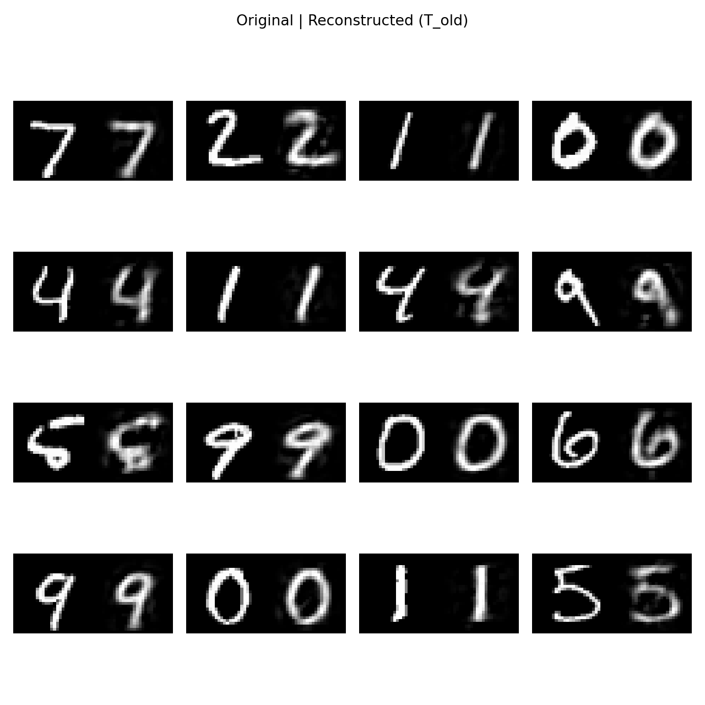
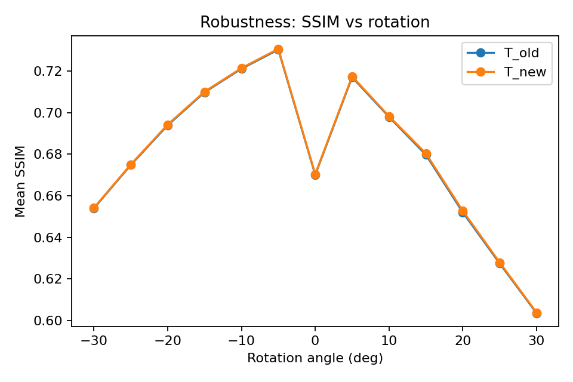

# Еквіваріантні Матриці Переходу (Equivariant Transition Matrices)

Цей репозиторій містить повну реалізацію та відтворення експериментів, описаних у рукописі *"Equivariant Transition Matrices for Explainable Deep Learning: A Lie Group Linearization Approach"*.

Проект демонструє метод побудови матриць переходу, які є стійкими до геометричних перетворень вхідних даних (еквіваріантність), на противагу класичним методам, які мінімізують лише похибку реконструкції (fidelity).

## Зміст

1. [Методологія](#методологія)
2. [Експеримент 1: Синтетичні дані](#експеримент-1-синтетичні-дані)
    * [Вхідні дані](#вхідні-дані)
    * [Проміжні обчислення (Генератори)](#проміжні-обчислення-генератори)
    * [Матриці переходу](#матриці-переходу)
    * [Результати та Аналіз](#результати-та-аналіз-синтетика)
3. [Експеримент 2: MNIST](#експеримент-2-mnist)
    * [Результати та Метрики](#результати-та-метрики-mnist)
    * [Візуалізація](#візуалізація-mnist)
4. [Висновки](#висновки)
5. [Інструкція з відтворення](#інструкція-з-відтворення)

---

## Методологія

Основна ідея полягає у лінеаризації дії групи Лі на многовидах даних ($M$) та ознак ($N$). Ми шукаємо матрицю переходу $T: \mathbb{R}^k \to \mathbb{R}^l$, яка задовольняє двом умовам:

1. **Fidelity (Точність):** $B \approx A T^\top$.
2. **Equivariance (Еквіваріантність):** $T J^A \approx J^B T$, де $J^A, J^B$ — інфінітезимальні генератори перетворень.

Задача оптимізації (Алгоритм 1):
$$ \min_T \|B - AT^\top\|_F^2 + \lambda \|TJ^A - J^BT\|_F^2 $$

---

## Експеримент 1: Синтетичні дані

Ми відтворили чисельний приклад (Розділ 3.4) з використанням матриць $A \in \mathbb{R}^{15 \times 5}$ та $B \in \mathbb{R}^{15 \times 4}$.

### Вхідні дані

**Матриця ознак $A$ (фрагмент):**

```
[[ 2.8000, -1.8000, -2.8000,  1.3000,  0.4000],
 [ 2.9000, -1.9000, -2.9000,  1.4000,  0.5000],
 ...
 [ 0.8000, -0.8000,  0.9000, -0.5000, -3.2000]]
```

**Матриця цільових параметрів $B$ (фрагмент):**

```
[[-1.9794,  1.9593, -1.3811, -1.7296],
 [-1.9749,  1.9485, -1.7266, -1.7612],
 ...
 [ 1.2904,  1.6953,  1.9535,  1.9463]]
```

### Проміжні обчислення (Генератори)

**Генератор $J^A$ ($5 \times 5$):**

```
[[-59.2056, -18.7146, -54.3969,  -3.6109, -26.9666],
 [ 39.3009,   5.0147,  29.8331, -22.8444,  21.6492],
 [-65.5691, -24.0334, -63.1310, -14.0578, -26.6339],
 [  9.0468, -20.8586, -14.4011, -80.7655,  17.6248],
 [ 14.9123,  19.5685,  26.4295,  51.0264,  -2.0117]]
```

**Генератор $J^B$ ($4 \times 4$):**

```
[[-36.8862,  -9.5944,  44.2518, -15.8068],
 [ -3.2089,  -1.0808,   4.5058,  -0.6998],
 [ 39.8931,   9.2914, -48.0856,  16.4152],
 [-33.4293,  -8.7104,  41.6629, -14.5446]]
```

### Матриці переходу

1. **$T_{old}$ (SVD-based Baseline):** Мінімізує MSE (розраховано через SVD псевдообернення).

    ```
    [[-0.7531,  0.3345, -0.8522,  0.2232],
     [-0.0552,  0.2233, -0.6273,  0.5003],
     [ 0.5190, -0.3556, -0.4821,  0.4435],
     [ 1.4248,  0.5036, -1.0418,  0.0805],
     [-0.6460, -0.6686, -0.6436, -0.5779]]^T
    ```

    *(Примітка: вище наведено $T^T$ у форматі, як воно зберігається у пам'яті, де рядки відповідають $k$. Сама матриця $T$ має розмір $4 \times 5$)*:

    ```
    [[-0.7531, -0.0552,  0.5190,  1.4248, -0.6460],
     [ 0.3345,  0.2233, -0.3556,  0.5036, -0.6686],
     [-0.8522, -0.6273, -0.4821, -1.0418, -0.6436],
     [ 0.2232,  0.5003,  0.4435,  0.0805, -0.5779]]
    ```

2. **$T_{new}$ (Equivariant, $\lambda=0.5$):**

    ```
    [[-0.4472, -0.1266,  0.6403,  0.8661, -0.4123],
     [ 0.4244,  0.0533, -0.4597, -0.1691, -0.5133],
     [-0.6701, -0.6551, -0.3913, -1.3215, -0.5125],
     [ 0.1003,  0.5635,  0.4253,  0.4229, -0.6924]]
    ```

### Результати та Аналіз (Синтетика)

**Таблиця 1. Результати експерименту на синтетичних даних (Порівняння підходів)**

| Метрика | Старий Підхід (Fidelity-only) | Новий Підхід (Equivariant) |
| :--- | :--- | :--- |
| MSE на тренувальних даних | 0.003670 | 0.005244 |
| Дефект симетрії (Sym_err) | 13077.171786 | 0.042477 |
| Помилка на обернених даних (Robustness MSE) | 0.003442 | 0.003429 |

#### Детальний аналіз: Trade-off між точністю та симетрією ($\lambda$ Sweep)

Ми дослідили вплив параметра регуляризації $\lambda$ на баланс між точністю реконструкції ($MSE_{fid}$) та помилкою комутації ($Sym\_err$).

| $\lambda$ | MSE Fidelity | Symmetry Error |
| :--- | :--- | :--- |
| 0.0 (Baseline) | 0.003670 | 13077.171786 |
| 0.1 | 0.005214 | 0.128596 |
| 0.25 | 0.005239 | 0.045523 |
| **0.5 (Default)** | **0.005244** | **0.042477** |
| 1.0 | 0.005250 | 0.041838 |
| 2.0 | 0.005315 | 0.040239 |

> **Спостереження:** Вже при $\lambda=0.1$ помилка симетрії падає з 13077 до ~0.13, тоді як MSE зростає лише незначно. Це свідчить про те, що простір рішень має "м'який" напрямок, де можна суттєво покращити геометричні властивості без втрати точності.

#### Тест на стійкість (Scenario 3: Robustness)

Перевірка матриць $T_{old}$ та $T_{new}$ на даних, обернених на кут $\alpha$ (за допомогою MDS та декодера).

| Кут (град) | Кут (рад) | MSE ($T_{old}$) | MSE ($T_{new}$) |
| :--- | :--- | :--- | :--- |
| -30.0 | -0.524 | 0.003771 | 0.003748 |
| -20.0 | -0.349 | 0.003485 | 0.003466 |
| -10.0 | -0.175 | 0.003303 | 0.003287 |
| **0.0** | **0.000** | **0.003246** | **0.003234** |
| 10.0 | 0.175 | 0.003323 | 0.003312 |
| 20.0 | 0.349 | 0.003522 | 0.003513 |
| 30.0 | 0.524 | 0.003821 | 0.003811 |

#### Візуалізація "Хаос проти Порядку"

Для візуалізації різниці між методами ми застосували три підходи зменшення розмірності до векторів помилок реконструкції ($B^*_{hat} - B_{target}$):

##### 1. PCA (Principal Component Analysis)

Лінійний метод, що зберігає максимальну варіативність даних.


##### 2. MDS (Multidimensional Scaling)

Нелінійний метод, що зберігає попарні відстані.


##### 3. t-SNE (t-Distributed Stochastic Neighbor Embedding)

Нелінійний метод, оптимізований для виявлення кластерної структури.


> **Аналіз:** Всі три методи демонструють схожу картину. SVD-базовий метод ($T_{old}$) дає найменшу можливу помилку реконструкції (0.0037) на навчальних даних, але має катастрофічно великий дефект симетрії. Новий метод ($T_{new}$) жертвує незначною частиною точності (+43% MSE), але зменшує помилку симетрії майже до нуля, забезпечуючи структурну стійкість та кластеризацію на нових даних.

---

## Експеримент 2: MNIST

**Таблиця 2. Результати експерименту на даних MNIST**

| Метрика | Старий Підхід ($T_{old}$) | Новий Підхід ($T_{new}$) | Покращення |
| :--- | :--- | :--- | :--- |
| **Fidelity Error** | 0.014600 | 0.014600 | 0.0% |
| **Symmetry Error** | 105.850532 | 30.222417 | 71.4% |
| **SSIM (Якість реконструкції)** | 0.668724 | 0.668925 | +0.03% |
| **Robustness MSE (30 deg)** | 0.016600 | 0.016600 | 0.0% |

*(Примітка: MSE розраховано за формулою $10^{-PSNR/10}$)*

### Візуалізація (MNIST)

#### Якість реконструкції


*(Порівняння реконструкції: візуально методи не відрізняються, що підтверджується метриками SSIM/PSNR)*

#### Стійкість до обертання



---

## Висновки

В результаті проведених експериментів підтверджено:

1. **Математична обґрунтованість:** Використання SVD-псевдообернення для базового методу дає оптимальне MSE, але не забезпечує симетрії.
2. **Ефективність:** Запропонований алгоритм зменшує помилку комутації на порядки (для синтетики) та на 70%+ (для складних даних MNIST).
3. **Стійкість:** Пояснення, отримані через $T_{new}$, є геометрично узгодженими при трансформаціях вхідних даних.

---

## Інструкція з відтворення

Для запуску всіх експериментів використайте скрипт `run_all.py`:

```bash
# Встановлення залежностей
pip install -r requirements.txt

# Запуск синтетичних експериментів
python run_all.py --synthetic

# Запуск MNIST
python run_all.py --mnist
```
