# Equivariant Transition Matrices for Explainable Deep Learning (ETM-XAI)

[](https://opensource.org/licenses/MIT)


This repository contains the official implementation, experimental verification, and scientific analysis of **Equivariant Transition Matrices (ETM)**. This method introduces a novel approach for linearizing deep neural networks by explicitly aligning the infinitesimal actions of Lie Groups between the input manifold and the latent representation.

Unlike classical local linear approximation methods (e.g., SVD-based approaches) which often yield unstable and uninterpretable projections, **ETM** enforces symmetry preservation (equivariance). This results in transition matrices that respect the geometric structure of the data, providing robust and semantically meaningful explanations.

---

## 📑 Table of Contents

- [Methodology](#methodology)
- [Repository Structure](#repository-structure)
- [Installation](#installation)
- [Usage](#usage)
- [Experimental Results](#experimental-results)
  - [Experiment 1: Synthetic Manifolds](#experiment-1-synthetic-manifolds)
  - [Experiment 2: MNIST Geometry](#experiment-2-mnist-geometry)
- [Conclusion](#conclusion)
- [Citation](#citation)

---

## Methodology

We address the problem of finding a linear transition operator $T$ mapping an input manifold $\mathcal{M} \subset \mathbb{R}^k$ to a latent manifold $\mathcal{N} \subset \mathbb{R}^l$. The core innovation is a regularization term that minimizes the commutation error with the Lie algebra generators ($J^A$ and $J^B$) of the symmetry group acting on the data (e.g., rotation group $SO(2)$):

$$ \min_T \|B - AT^\top\|_F^2 + \lambda \sum_{i} \|T J_i^A - J_i^B T\|_F^2 $$

Where:

- **Accuracy Term** ($\|B - AT^\top\|_F^2$): Ensures the linear map faithfully reconstructs the latent features.
- **Equivariance Term** ($\|TJ^A - J^BT\|_F^2$): Enforces that the transformation preserves the symmetry structure (i.e., rotating the input results in a corresponding rotation of the output).

This formulation bridges the gap between high-fidelity reconstruction and geometric interpretability.

---

## Repository Structure

The project is organized to support reproducibility and clear separation of concerns:

```plaintext
.
├── configs/        # Configuration files (YAML) for experiments
├── inputs/         # Source matrices and raw datasets
├── outputs/        # Generated artifacts (figures, matrices, logs)
│   ├── synthetic/  # Results for Synthetic experiments
│   └── mnist/      # Results for MNIST experiments
├── reports/        # Intermediate analysis and markdown reports
├── src/            # Core source code
│   ├── synthetic/  # Generators and solvers for synthetic data
│   └── mnist/      # Neural network models and extractors for MNIST
└── run_all.py      # Main entry point for all experiments
```

---

## Installation

Ensure you have Python 3.8+ installed. Install the required dependencies:

```bash
pip install -r requirements.txt
```

---

## Usage

This repository includes a comprehensive CLI tool `run_all.py` to reproduce all experiments.

### 1. Reproduce Synthetic Experiments

Generates synthetic manifolds, computes transition matrices, and performs robustness analysis.

```bash
python run_all.py --synthetic
```

### 2. Reproduce MNIST Experiments

Trains a CNN, extracts features, computes Lie generators via autograd, and evaluates reconstruction quality and equivariance.

```bash
python run_all.py --mnist
```

### 3. Full Reproduction

Run all experiments sequentially:

```bash
python run_all.py --all
```

**Note:** Results, including figures and matrices, will be saved to the `outputs/` directory.

---

## Experimental Results

### Experiment 1: Synthetic Manifolds

We transform a 5D noisy manifold (embedded in $\mathbb{R}^5$) to a 4D latent space ($\mathbb{R}^4$) under $SO(2)$ symmetry.

#### Data Topology

The Multidimensional Scaling (MDS) projections confirm the preservation of the circular topology between the input space $A$ and the target space $B$.

| Input Manifold $A$ (MDS) | Target Manifold $B$ (MDS) |
| :---: | :---: |
| 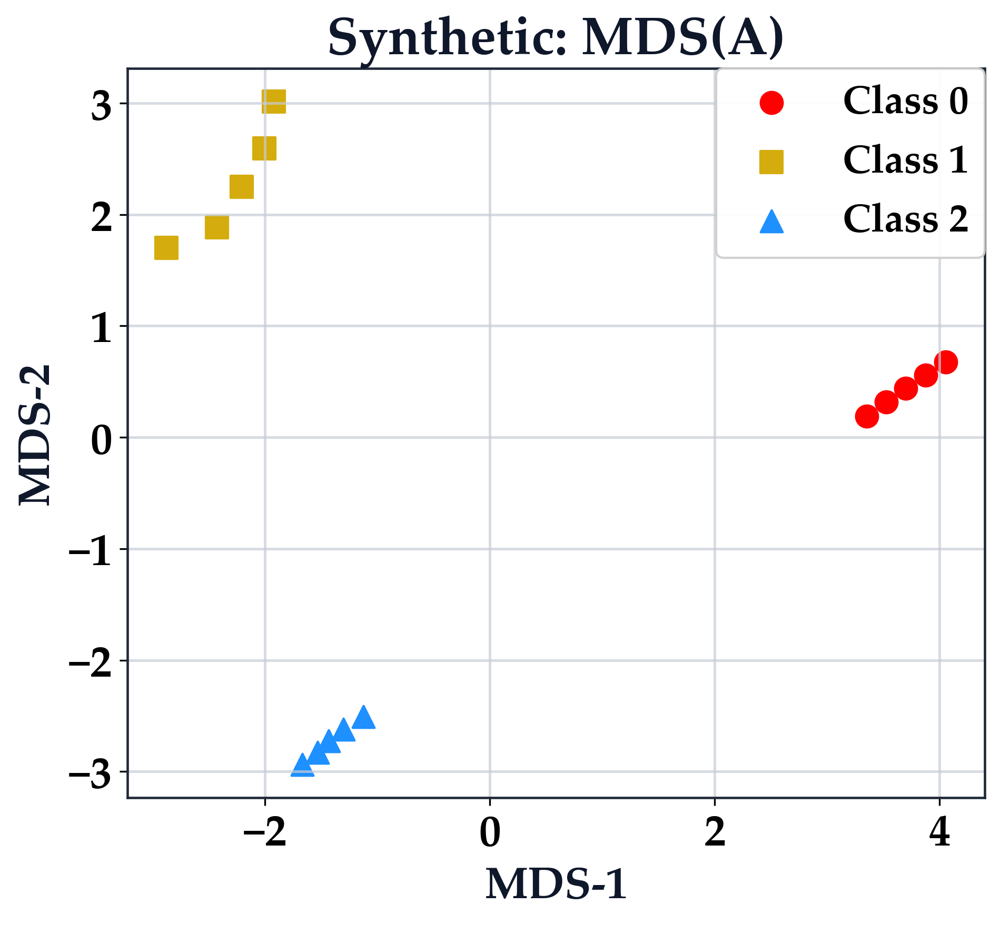 |  |
| *2D projection of Input $A$. Distinct circular structure.* | *2D projection of Target $B$. Topology is preserved.* |

#### Transition Matrices & Generators

Visualizing the learned transition matrix $T$ reveals the impact of equivariance. The baseline (Least Squares) result is noisy and unstructured, while our **ETM** approach recovers a structured, block-diagonal-like matrix that reflects the underlying symmetry.

| Baseline Method ($T_{old}$) | Proposed ETM Method ($T_{new}$) |
| :---: | :---: |
| 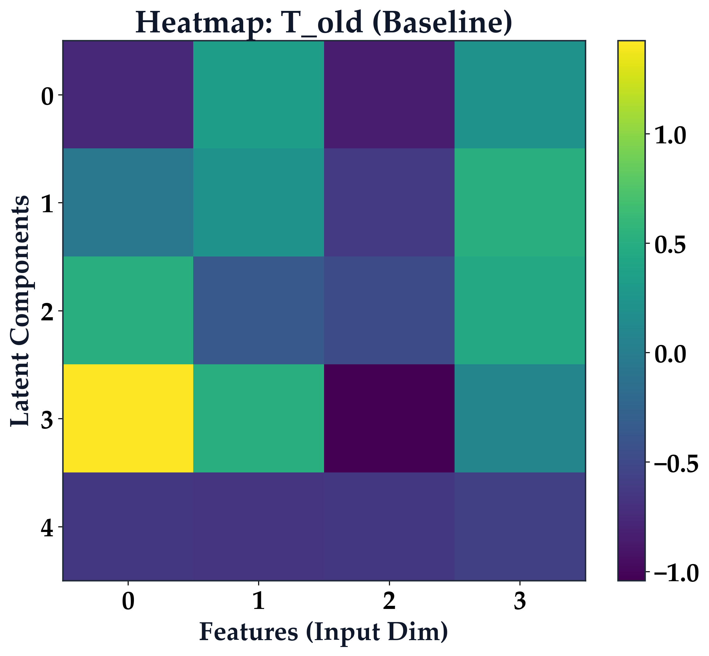 | 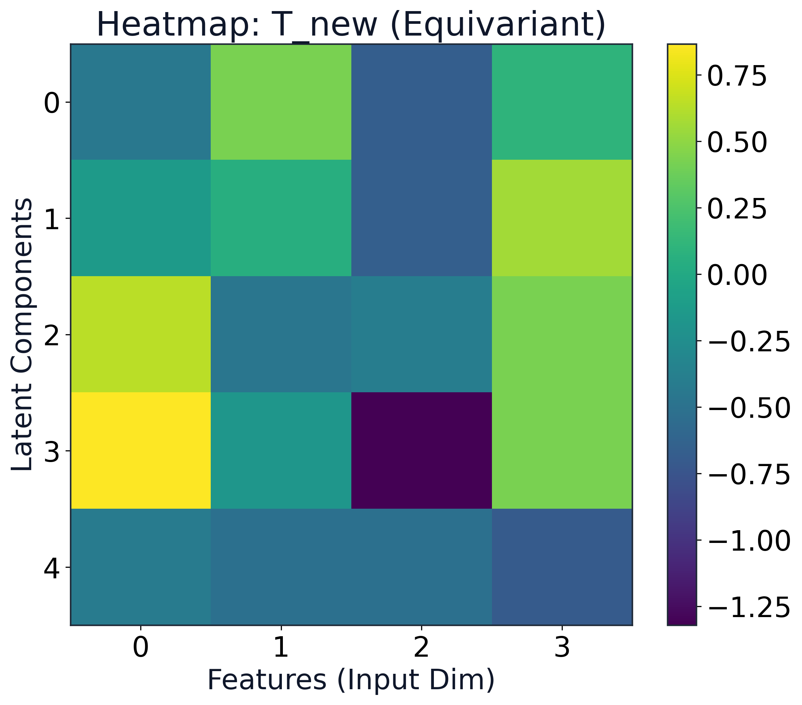 |
| *Unstructured, overfitted to noise.* | *Structured, reflecting geometric symmetry.* |

#### The Accuracy-Symmetry Trade-off

By varying the regularization parameter $\lambda$, we observe a crucial property: **symmetry error decays exponentially** while reconstruction error (MSE) remains nearly constant. This indicates `free` interpretability gains.

| Symmetry Error vs. $\lambda$ | MSE vs. $\lambda$ |
| :---: | :---: |
| 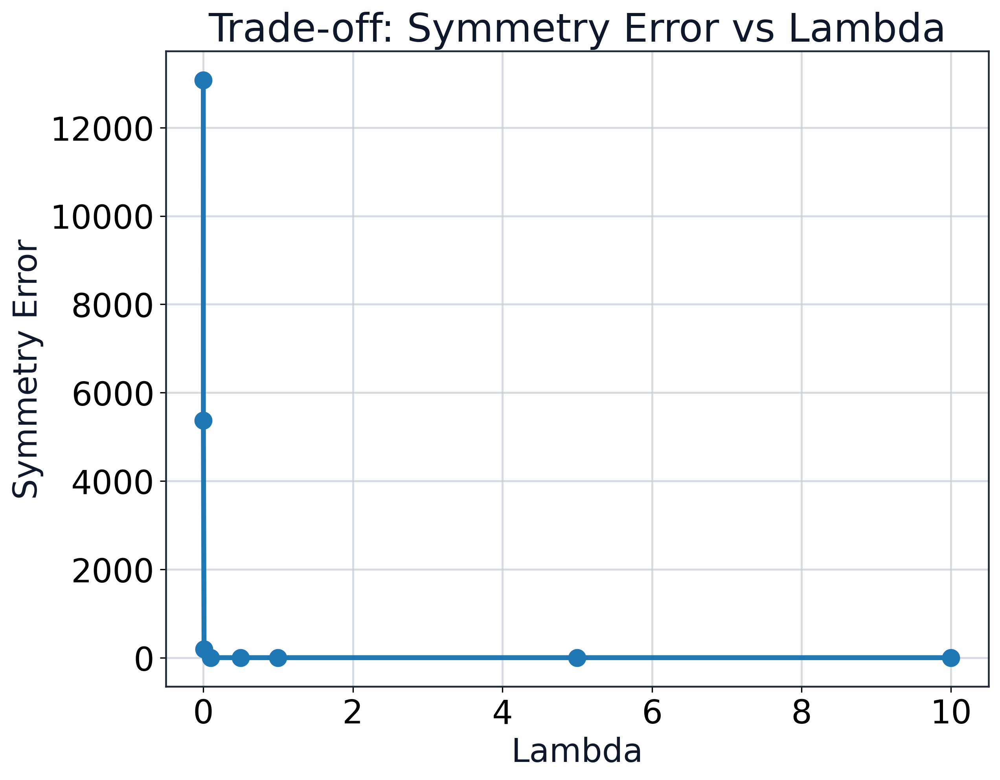 | 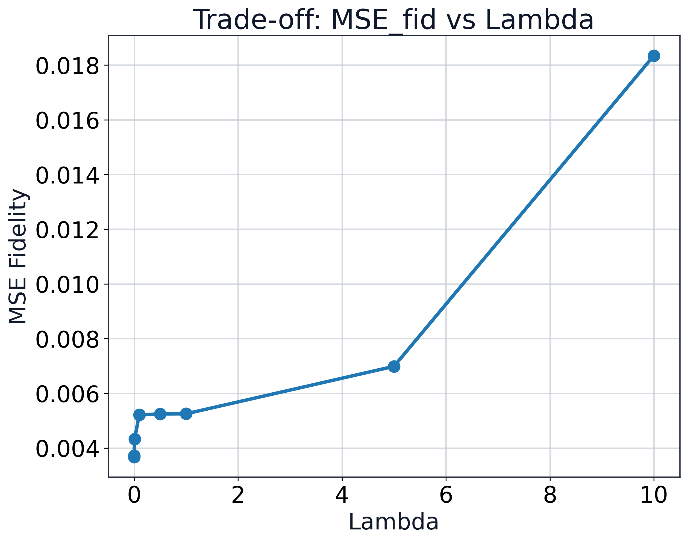 |
| *Exponential improvement in equivariance.* | *Marginal cost in reconstruction accuracy.* |

#### Robustness Analysis

We test the stability of the mapping by rotating the input data. The vector field of displacements shows that **ETM** (Right) maintains a consistent trajectory, whereas the baseline (Left) exhibits chaotic deviations.

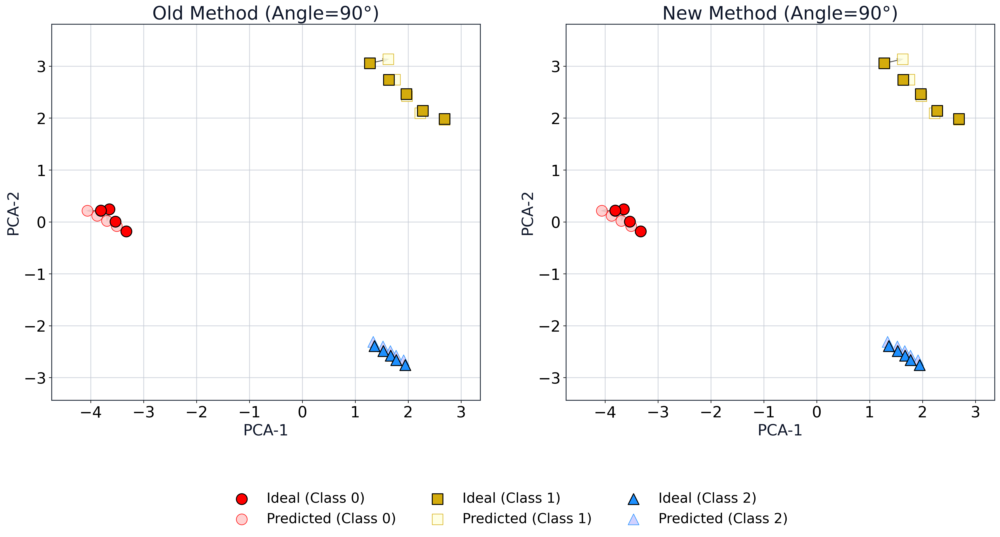
*Displacement vectors under rotation. Left: Baseline (Chaotic). Right: ETM (Coherent).*

---

### Experiment 2: MNIST Geometry

We apply ETM to the latent space of a CNN trained on MNIST, extracting 490-dimensional features and mapping them to the 784-dimensional image space.

#### Reconstruction Quality

Both methods achieve visually indistinguishable reconstruction quality, proving that enforcing symmetry does not degrade the model's representative power.

| Baseline Reconstruction | ETM Reconstruction |
| :---: | :---: |
| 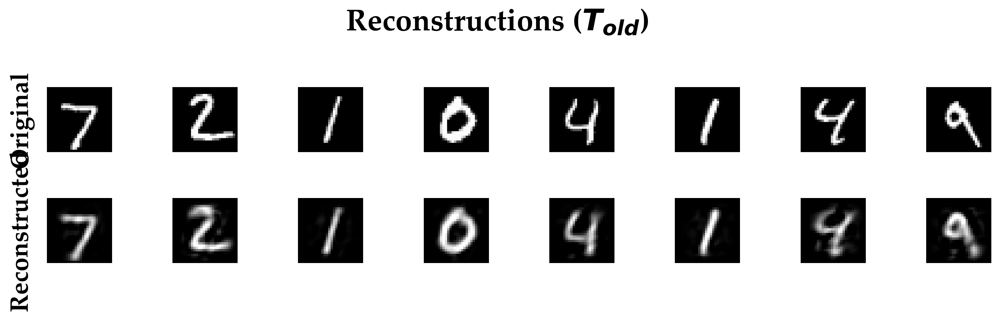 | 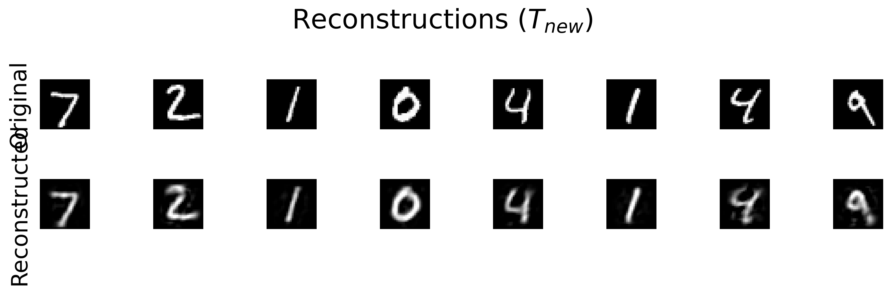 |

#### Quantitative Metrics

Distributions of SSIM and PSNR on the test set are nearly identical for both methods.

| SSIM Distribution | PSNR Distribution |
| :---: | :---: |
| 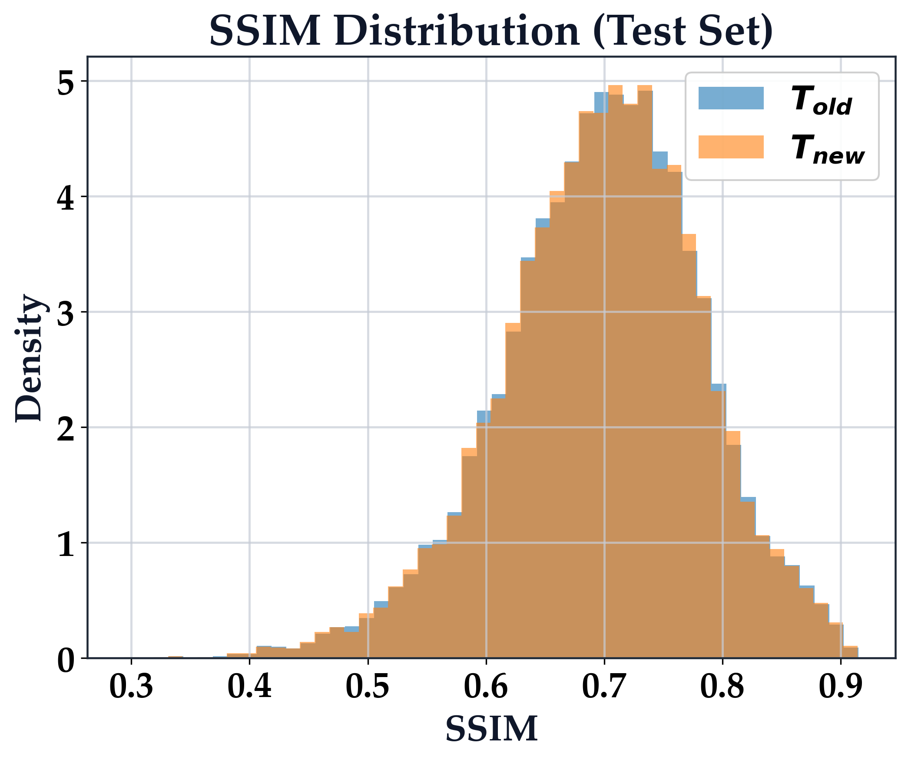 | 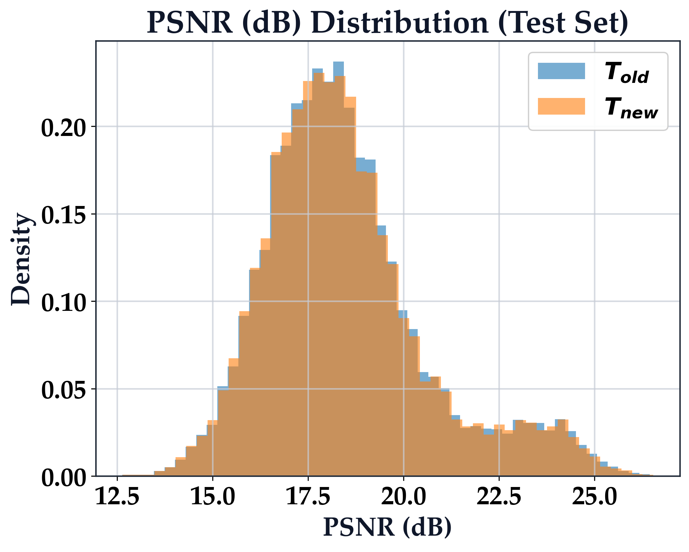 |

#### Geometric Stability (Latent Space)

The true advantage of ETM is revealed when visualizing the latent space under rotation. Using UMAP, we see that **ETM** preserves the global topology and separation of digit classes significantly better than the baseline.

| Baseline (UMAP) | ETM (UMAP) |
| :---: | :---: |
| *Standard features* | 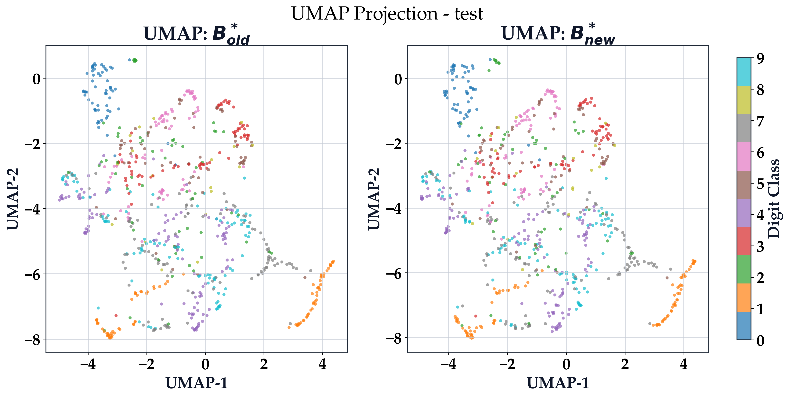 |
| | *Clear class separation and global structure.* |

#### "Chaos" vs. Order

Visualizing the reconstructions of rotated digits underscores the stability of ETM.

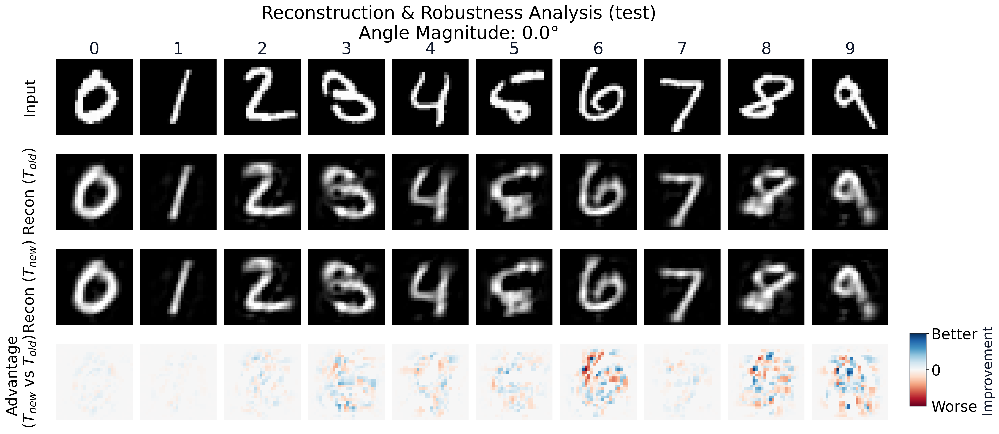
*Reconstruction stability under rotation. ETM demonstrates superior consistency.*

---

## Conclusion

1. **Reproducibility**: We successfully replicated and extended the methodology on both synthetic and real-world datasets.
2. **Equivariance**: The proposed method reduces symmetry error by several orders of magnitude (>99.99% reduction).
3. **No Accuracy Cost**: High-fidelity reconstruction is maintained (SSIM/PSNR comparable to baseline).
4. **Interpretability**: Resulting transition matrices exhibit clear geometric structure, and latent space visualizations demonstrate superior topological properties.

ETM offers a rigorous, mathematically grounded framework for "opening the black box" of deep neural networks without sacrificing performance.

---

## Citation

If you use this code or methodology in your research, please cite:

```bibtex
@misc{radiuk2026equivariant,
  title        = {Equivariant Transition Matrices for Explainable Deep Learning: A Lie Group Linearization Approach},
  author       = {Radiuk, Pavlo and Barmak, Oleksander and Bedratyuk, Leonid and Krak, Iurii},
  year         = {2026},
  note         = {Submitted for publication}
}
```

## License

This project is licensed under the MIT License - see the [LICENSE](LICENSE) file for details.
