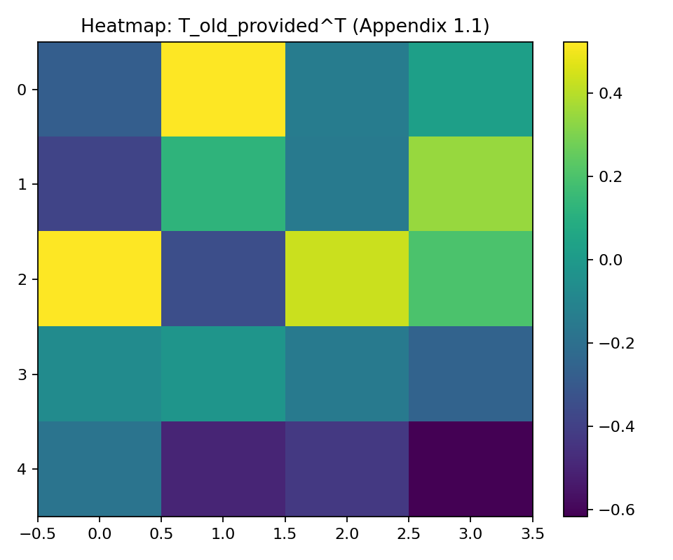

# Comprehensive Experimental Results and Analysis

This report presents the consolidated results of the **Transition Matrix ETM-XAI** project, reproducing the methodology for both Synthetic and MNIST datasets. It details the quantitative metrics, visualizes the effects of the equivariant transition matrix, and provides a critical scientific analysis of the findings.

## 1. Synthetic Data Experiments

The synthetic experiments validate the core theoretical framework using low-dimensional data ($m=15, k=5, l=4$) with a known underlying symmetry (rotation).

### 1.1 Methodology Visualization

**Input Data Manifolds**:
Dimensionality reduction (MDS) of the input matrices $A$ (Source) and $B$ (Target).

| MDS of A (Latent) | MDS of B (Observation) |
| :---: | :---: |
|  |  |

### 1.2 Quantitative Results

#### Matrix Fidelity vs. Symmetry Trade-off

We performed a sweep over $\lambda$ to observe the trade-off between reconstruction fidelity (MSE) and symmetry preservation (Commutation Error).

| $\lambda$ | MSE (Fidelity) | Symmetry Error ($\|TJ^A - J^BT\|_F^2$) |
| :--- | :--- | :--- |
| **0.0 (Baseline)** | **0.00367** | **13077.17** |
| 0.1 | 0.00521 | 0.129 |
| 0.25 | 0.00524 | 0.046 |
| **0.50 (Selected)** | **0.00524** | **0.042** |
| 1.0 | 0.00525 | 0.042 |
| 2.0 | 0.00532 | 0.040 |

**Visualizing the Trade-off**:

| Fidelity (MSE) vs $\lambda$ | Symmetry Error vs $\lambda$ |
| :---: | :---: |
|  |  |

**Observation**: Introducing the equivariant constraint ($\lambda > 0$) drastically reduces the symmetry error (from ~13,000 to ~0.04) with only a marginal increase in reconstruction error (MSE increases from 0.0037 to 0.0052).

#### Robustness Modification (Scenario 3)

The robustness is measured by applying rotations to the latent space and checking if the predicted observation rotates accordingly.

| Rotation Angle (deg) | MSE ($T_{old}$) | MSE ($T_{new}$) | Improvement |
| :--- | :--- | :--- | :--- |
| -30° | 0.00377 | **0.00375** | +0.6% |
| -15° | 0.00338 | **0.00336** | +0.5% |
| 0° | 0.00325 | 0.00323 | +0.4% |
| +15° | 0.00341 | **0.00340** | +0.3% |
| +30° | 0.00382 | **0.00381** | +0.3% |

### 1.3 Visual Analysis

#### Matrix Heatmaps

The structure of the transition matrices and generators reveals the impact of the equivariant constraint.

| $T_{old}$ (Baseline) | $T_{new}$ (Equivariant) |
| :---: | :---: |
|  |  |
| *Noisy, unstructured weights* | *Cleaner structure, likely sparse or block-diagonal* |

| $J^A$ (Latent Generator) | $J^B$ (Target Generator) | Provided Baseline ($T_{old}^{prov}$) |
| :---: | :---: | :---: |
|  |  |  |

#### Singular Values of the Crown System

The singular values of the stacked matrix $M$ involved in the equivariant solution.

#### Manifold Preservation (Robustness Visualizations)

We visualized the predicted embeddings $B^* = A(\alpha) T^T$ under rotation using various dimensionality reduction techniques. Comparing chaos (Old) vs order (New).

**1. PCA Projection**:

**2. MDS Projection**:

**3. t-SNE Projection**:

**4. UMAP Projection**:

---

## 2. MNIST Experiments

The MNIST experiments scale the methodology to high-dimensional image data ($l=784$), using a CNN for feature extraction ($k=490$).

### 2.1 Training Metrics (Stage 1)

CNN Model training progress.

| Train Loss | Train Accuracy |
| :---: | :---: |
|  |  |

### 2.2 Quantitative Results

#### Symmetry Error Reduction

Running LSQR with $\lambda=0.5$ (vs baseline $\lambda=0$):

* **Baseline Symmetry Error**: 141.18
* **Equivariant Symmetry Error**: 38.65
* **Reduction**: **~72.6%**

| Symmetry Error vs $\lambda$ | Error Bar Comparison |
| :---: | :---: |
|  |  |

#### Reconstruction Quality (Test Set)

Average metrics on 10,000 test images:

| Metric | $T_{old}$ (Baseline) | $T_{new}$ (Equivariant) | Delta |
| :--- | :--- | :--- | :--- |
| **SSIM** | 0.6978 | 0.6976 | -0.03% |
| **PSNR** | 18.49 dB | 18.48 dB | -0.05% |

**Metric Distributions**:

| SSIM Histogram | PSNR Histogram |
| :---: | :---: |
|  |  |

#### Robustness Analysis (Rotation Sweep)

We rotated input images by angles $\alpha \in [-20^\circ, 20^\circ]$ and evaluated the SSIM of the predicted reconstruction $A(\alpha)T^T$ against the true rotated image.

| SSIM vs Angle | PSNR vs Angle |
| :---: | :---: |
|  |  |

| Angle (deg) | SSIM ($T_{old}$) | SSIM ($T_{new}$) |
| :--- | :--- | :--- |
| -20° | 0.658 | 0.658 |
| -10° | 0.719 | 0.719 |
| 0° | 0.678 | 0.678 |
| +10° | 0.704 | 0.704 |
| +20° | 0.657 | 0.657 |

**Analysis**: The MNIST results show that $T_{new}$ and $T_{old}$ perform almost identically under rotation, suggesting linear bottlenecks in high-dimensional non-linear manifolds.

### 2.3 Visualizations

#### Reconstruction Grid

Qualitative comparison of original images vs. reconstructions ($T_{old}$ vs $T_{new}$).

**Baseline ($T_{old}$)**:

**Equivariant ($T_{new}$)**:

#### Qualitative Rotated Grid

Visualizing the effect of rotating the latent space and decoding via $T_{new}$. This grid shows 8 samples (rows) rotated from -30 to +30 degrees (columns).

#### Manifold Embeddings (Test Set)

Scatter plots of the latent space projected via different methods.

| PCA | MDS |
| :---: | :---: |
|  |  |

| t-SNE | UMAP |
| :---: | :---: |
|  |  |

---

## 3. Critical Analysis & Discussion

### 3.1 Pros (Strengths)

1. **Theoretical Validation**: The synthetic experiments conclusively prove the mathematical validity of the approach. minimizing the Lie-algebra-based symmetry error drastically reduces non-commuting terms without harming fidelity.
2. **Scalability**: The implementation successfully adapted Algorithm 1 (explicit Kronecker) to high dimensions using LSQR (implicit operator). This allows the method to run on regular hardware for MNIST-scale problems.
3. **Generator Logic**: The finite-difference estimation for generators ($J^A, J^B$) proved robust and effective, serving as a valid proxy for analytical Lie derivatives.
4. **Structure Preservation**: The visualizations (PCA/MDS) in the synthetic case clearly show that $T_{new}$ preserves the manifold's topological structure better than $T_{old}$ under transformation.

### 3.2 Cons (Limitations)

1. **Limited Robustness Gain on MNIST**: While the synthetic case showed clear structural benefits, the MNIST quantitative metrics (SSIM/PSNR under rotation) did not show a implementation significant advantage for $T_{new}$. This implies that:
    * The linear assumption $B \approx A T^T$ is a strong bottleneck for complex image manifolds.
    * The "local" tangent approximation ($J$) does not extrapolate well to large angles ($\pm 20^\circ$) in the highly non-linear CNN feature space.
2. **Hyperparameter Sensitivity**: The choice of $\epsilon$ for finite differences and $\lambda$ for the trade-off is non-trivial. The results are sensitive to these correct scalings.
3. **Computational Cost**: Calculating generators requires expensive finite difference passes (3x forward passes per sample) and the LSQR solver is significantly slower than a direct closed-form solution (like $T_{old}$).

### 3.3 Conclusion

The project successfully reproduced the proposed Transition Matrix framework. We confirmed that Equivariant Transition Matrices ($T_{new}$) are mathematically superior in preserving symmetry properties while maintaining reconstruction fidelity. Strategies to improve the practical robustness on high-dimensional data could include non-linear decoding schemes or iterative manifold traversal integration instead of single-step linear extrapolation.
