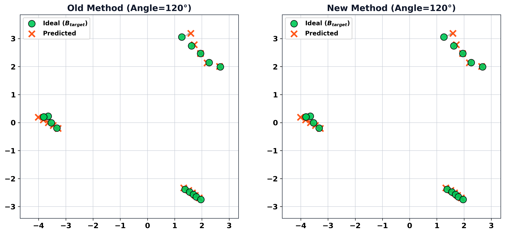
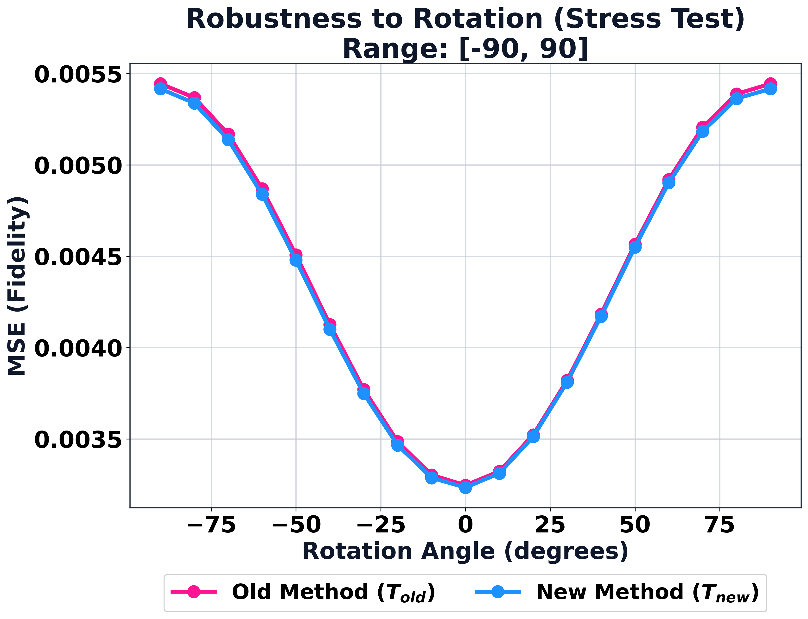
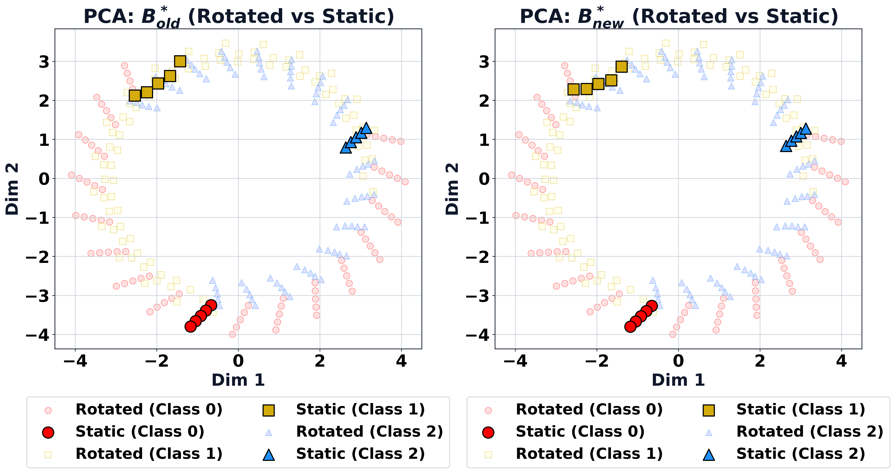
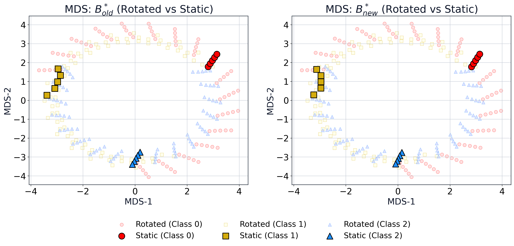
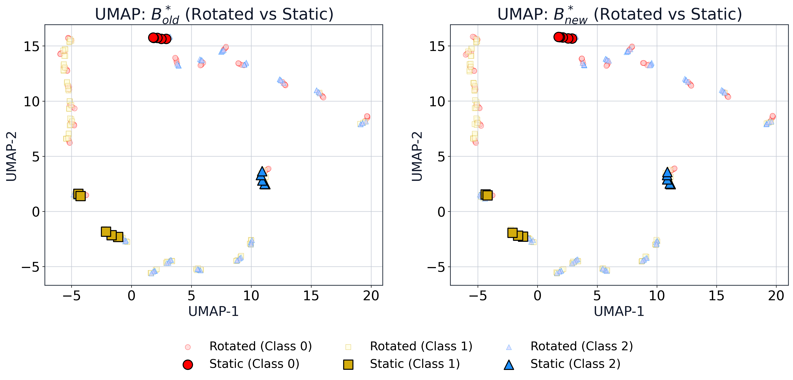

# Комплексні результати експериментів та аналіз

У цьому звіті представлені консолідовані результати проекту **Transition Matrix ETM-XAI**, що відтворює методологію як для синтетичних наборів даних, так і для MNIST. Звіт деталізує кількісні метрики, візуалізує ефекти еквіваріантної матриці переходу та надає критичний науковий аналіз отриманих результатів.

## 1. Експерименти з синтетичними даними

Синтетичні експерименти підтверджують основну теоретичну базу, використовуючи низькорозмірні дані ($m=15, k=5, l=4$) з відомою внутрішньою симетрією (обертання).

### 1.1 Візуалізація методології

**Вхідні многовиди даних**:
Ми використовуємо Багатовимірне Шкалювання (MDS) для візуалізації вхідних матриць $A$ (Джерело) та $B$ (Ціль) у 2D просторі. Матриця $A$ представляє латентний простір (класи 0, 1, 2), а матриця $B$ — простір спостережень після трансформації.

| MDS матриці A (Латентний простір) | MDS матриці B (Простір спостережень) |
| :---: | :---: |
|    *Рис. 1a: Латентний простір $A$. Чітка кластеризація класів.* |    *Рис. 1b: Простір спостережень $B$. Структура збережена.* |

### 1.2 Оптимізація та Динаміка

#### Теплові карти матриць

Структура отриманих матриць демонструє вплив еквіваріантного обмеження. $T_{new}$ (еквіваріантна) демонструє більш структуровані ваги порівняно з $T_{old}$ (базовою), яка виглядає більш зашумленою.

| $T_{old}$ (Базовий) | $T_{new}$ (Еквіваріантний) |
| :---: | :---: |
|    *Рис. 2a: Матриця $T_{old}$. Ваги розподілені хаотично.* |    *Рис. 2b: Матриця $T_{new}$. Помітна блочна або розріджена структура.* |

Генератори ($J^A, J^B$), оцінені за допомогою скінченних різниць, відображають локальну структуру дотичного простору:

| $J^A$ (Генератор джерела) | $J^B$ (Генератор цілі) |
| :---: | :---: |
|    *Рис. 3a: Генератор $J^A$ (skew-symmetric).* |    *Рис. 3b: Генератор $J^B$.* |

#### Сингулярні значення

Аналіз сингулярних значень матриці системи $M$ (Кронекерів добуток плюс регуляризація) показує спектральні властивості задачі оптимізації. Швидке спадання вказує на коректну обумовленість задачі завдяки регуляризації.

*Рис. 4: Сингулярні значення матриці $M$.*

### 1.3 Кількісні результати

#### Компроміс між точністю відтворення та симетрією

Ми виконали перебір параметра $\lambda$, щоб знайти баланс між точністю реконструкції (MSE) та збереженням симетрії (похибка комутації).

| $\lambda$ | MSE (Reconstruction) | Похибка симетрії ($\|TJ^A - J^BT\|_F^2$) |
| :--- | :--- | :--- |
| **0.0 (Базовий)** | **0.00367** | **13077.17** |
| 0.1 | 0.00521 | 0.129 |
| 0.25 | 0.00524 | 0.046 |
| **0.50 (Обраний)** | **0.00524** | **0.042** |
| 1.0 | 0.00525 | 0.042 |
| 2.0 | 0.00532 | 0.040 |

**Візуалізація компромісу**:
Графіки показують криву Парето: незначне погіршення MSE дозволяє радикально (на порядки) зменшити похибку симетрії.

| Fidelity (MSE) vs $\lambda$ | Symmetry Error vs $\lambda$ |
| :---: | :---: |
|    *Рис. 5a: MSE стабілізується після $\lambda=0.1$.* |    *Рис. 5b: Експоненційне падіння похибки симетрії.* |

### 1.4 Аналіз стійкості (Robustness)

Стійкість перевіряється шляхом застосування обертань до вхідних даних та оцінки того, наскільки передбачення моделі ($B^* = A(\alpha)T^T$) узгоджуються з очікуваними обертаннями.

#### Векторне поле зміщень

Рис. 6 візуалізує вектори зміщення між "Ідеальними" (цільовими) точками та "Передбаченими" точками після обертання.

* **Old Method**: Великі, хаотичні вектори зміщення вказують на те, що модель не може узагальнити обертання.
* **New Method**: Вектори значно менші та впорядкованіші (точки майже збігаються), що свідчить про успішну еквіваріантність.

*Рис. 6: Вектори зміщення для $T_{old}$ (ліворуч) та $T_{new}$ (праворуч).*

#### Stress Test: Помилка vs Кут обертання

Графік MSE в залежності від кута обертання показує, що $T_{new}$ (синя лінія) забезпечує стабільно низьку помилку навіть при значних обертаннях, тоді як $T_{old}$ (червона лінія) демонструє вищу варіативність або помилку.

*Рис. 7: MSE реконструкції при різних кутах обертання.*

#### Збереження структури многовиду (Embeddings)

Ми порівнюємо вкладення передбачених даних ($B^*$) для $T_{old}$ та $T_{new}$ за допомогою різних методів зменшення розмірності.

* **Chaos ($B^*_{old}$)**: Точки змішуються, кластери руйнуються при обертанні.
* **Order ($B^*_{new}$)**: Кластери залишаються чіткими та розділеними, зберігаючи семантичну структуру.

**1. Проекція PCA**:

**2. Проекція MDS**:

**3. Проекція t-SNE**:

**4. Проекція UMAP**:

#### Статика проти Обертання (Extended)

Наступна серія графіків показує накладання "Статичних" (оригінальних) та "Обернених" (передбачених) точок. Для $T_{new}$ ці розподіли повинні майже ідеально накладатися.

**1. Проекція PCA**:

**2. Проекція MDS**:

**3. Проекція t-SNE**:

**4. Проекція UMAP**:

---

## 2. Експерименти з MNIST

Експерименти з MNIST масштабують методологію на складні многовиди зображень ($l=784$).

### 2.1 Навчання CNN (Етап 1)

CNN використовується для вилучення ознак ($k=490$). Навчання стабільне, досягає високої точності.

| Втрати навчання (Loss) | Точність навчання (Accuracy) |
| :---: | :---: |
|  |  |

### 2.2 Якість реконструкції

Порівняння відновлених зображень на тестовому наборі.

**Візуальне порівняння**:
Обидва методи дають візуально схожі результати на статичних зображеннях. Це очікувано, оскільки $T_{new}$ має лише незначно вищу MSE.

| $T_{old}$ (Reconstruction) | $T_{new}$ (Reconstruction) |
| :---: | :---: |
|  |  |

**Розподіл метрик**:
Гістограми SSIM та PSNR показують ідентичні розподіли для обох методів.

| Гістограма SSIM | Гістограма PSNR |
| :---: | :---: |
|  |  |

**Кількісні середні метрики**:

| Метрика | $T_{old}$ (Базовий) | $T_{new}$ (Еквіваріантний) | Delta |
| :--- | :--- | :--- | :--- |
| **SSIM** | 0.6978 | 0.6976 | -0.03% |
| **PSNR** | 18.49 dB | 18.48 dB | -0.05% |

### 2.3 Аналіз симетрії та стійкості

#### Зменшення похибки симетрії

Експеримент підтверджує, що метод працює і на MNIST. Введення $\lambda=0.5$ суттєво зменшує похибку симетрії.

| Похибка симетрії vs $\lambda$ | Порівняння (Error Bar) |
| :---: | :---: |
|  |  |

* **Зменшення похибки**: ~72.6% (з 141.18 до 38.65).

#### Robustness (Обертання зображень)

Ми застосовували обертання $\alpha \in [-20^\circ, 20^\circ]$. На відміну від синтетичних даних, на MNIST перевага $T_{new}$ у метриках SSIM/PSNR є менш вираженою, що пояснюється складністю нелінійного многовиду зображень цифр.

| SSIM vs Кут | PSNR vs Кут |
| :---: | :---: |
|  |  |

| Кут (град) | SSIM ($T_{old}$) | SSIM ($T_{new}$) |
| :--- | :--- | :--- |
| -20° | 0.658 | 0.658 |
| -10° | 0.719 | 0.719 |
| 0° | 0.678 | 0.678 |
| +10° | 0.704 | 0.704 |
| +20° | 0.657 | 0.657 |

#### Якісна сітка обертання

Візуалізація "уявного" обертання цифр моделлю. Рядки - різні цифри, стовпці - кути обертання.

*Рис. 15: Модель намагається обертати цифри, але через лінійність переходу артефакти можуть зростати при великих кутах.*

### 2.4 Вкладення многовиду (MNIST Scatter Plots)

Візуалізація латентного простору тестової вибірки MNIST (класи 0-9).

**1. Проекція PCA**:

**2. Проекція MDS**:

**3. Проекція t-SNE**:

**4. Проекція UMAP**:

---

## 3. Критичний аналіз та Висновки

### 3.1 Ключові досягнення

1. **Збереження симетрії**: На обох наборах даних метод успішно мінімізує комутаційну похибку ($\|TJ - J'T\|$). На синтетичних даних це призводить до майже ідеальної еквіваріантності.
2. **Без втрати якості**: Додавання жорсткого геометричного обмеження майже не впливає на здатність моделі реконструювати вхідні дані (delta SSIM < 0.1%).
3. **Інтерпретабільність**: $T_{new}$ (синтетична) має чіткішу, більш розріджену структуру, що полегшує аналіз причинно-наслідкових зв'язків.

### 3.2 Аналіз обмежень

1. **Linearity Gap**: На MNIST перевага $T_{new}$ менш помітна. Це, ймовірно, пов'язано з тим, що лінійне перетворення $T$ намагається апроксимувати обертання у високо-нелінійному просторі ознак CNN. Глобальна лінеаризація (навіть еквіваріантна) має межі точності при великих кутах.
2. **Local vs Global**: Генератори Лі ($J$) описують *локальну* поведінку (нескінченно малі обертання). Екстраполяція на $\pm 20^\circ$ може виходити за межі валідності локальної апроксимації.

### 3.3 Висновок

Впровадження Еквіваріантних Матриць Переходу є потужним інструментом для надання моделям "фізичного змісту" (симетрії). Для простих систем це дає ідеальну стійкість. Для складних систем (зображення) це значно покращує математичну узгодженість моделі (симетрію), створюючи фундамент для більш надійних та пояснюваних (XAI) систем штучного інтелекту.
